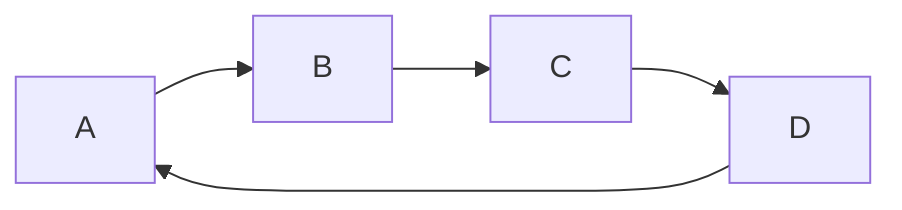

# linux操作系统

```ini
时间:2020年12月21日13:40:49
编写:王晨
```


## 1. 版本介绍

- ubuntu
- centOS
- Redhat


## 2. 基本操作

- 进程操作

```shell
# 查看进程
ps -ef | grep xxx
# kill进程
kill-9 PID
# 批量kill uvicorn进程
ps -ef |grep uvicorn |awk '{print $2}'|xargs kill -9
# 查看端口占用情况
lsof -i:端口号

# 内存占用
free -h / free -m
```

- 文件操作

```shell
# 删除目录
rm -rf .git/
# 查看
ls
tree / # 目录树结构
pwd # 路径结构
tar -zxvf # 解压缩文件 .gz后缀
tar -xvf # 解压缩文件 .tar后缀
> access.log #清空文件
```

- 防火墙

```shell
sudo ufw status
# inactive 关闭,active 开启
sudo ufw enable # 开启防火墙 
sudo ufw disable # 关闭防火墙
ufw allow/deny
sudo ufw allow 22 # 开启端口
ufw delete allow/deny 20 # 移除
```


### 2.1服务器离线下载环境

- python环境

  ```python
  # 下载安装包
  pip download -d /home/wangchen/packages fastapi[all]
  # 拷贝
  scp -r wangchen@10.50.63.63:/home/wangchen/packages D:\work\packages
  # 安装
  pip install --no-index --find-links=D:\work\packages fastapi[all]
  
  # 判断是否安装成功
pip list
  ```
  
- pip操作

  ```
  pip3 install xxx==1.1.0
  pip3 uninstall xxx
  ```

  

## 3. 实操问题

### 3.1 部署前端项目

- [离线安装nodejs](https://blog.csdn.net/topswim/article/details/79200936)

-  **复制工程打包文件到服务器**

   ```shell
   mkdir wangchen 
   # 上传工程文件至服务器指定位置 build
   scp -r build wangchen@10.50.63.63:/home/wangchen
   
   ```

- 安装nginx

   ```shell
   # 安装 nginx
   sudo apt-get install nginx
   # 在nginx配置文件夹中新增配置文件 
   sudo vim /ect/nginx/sites-enabled/webconf
   # 增加server配置 
   server{
   	listen 8064;
   	charset utf-8;
   	location / {
   		root 指定的build文件夹所在根目录
   		index index.html index.htm;
   		try_files $uri $uri/ /index.html;
   	}
   }
   
   # 启动 nginx 
   sudo service nginx start
   # 重启 nginx 
   sudo service nginx reload
   # 关闭 nginx
   sudo service nginx stop
   
   ```


### 3.2 部署fastapi项目

- 拷贝python代码到服务器

  ```shell
  uvicorn main:app --reload
  uvicorn main:app --host '0.0.0.0' --port 8065 --reload
  ```

- 使用nohup遇到的问题？

  - nohup: ignoring input and appending output to 'nohup.out'

    ```shell
    # 方法一 丢到dev/null 不需要输出日志 风险高需要工程内部处理日志
    nohup command >/dev/null 2>&1 &
    # 后台运行
nohup uvicorn main:app --host '0.0.0.0' --port 8065 >/dev/null 2>&1 &
    ```
    
  
- **使用 nginx+superviosr+uvicorn 来配置fastapi项目**

  ```shell
  sudo vim /ect/nginx/sites-enabled/web_server
  server{
      listen 8050;
      location / {
        proxy_pass http://127.0.0.1:8065;
        proxy_set_header Host $host;
        proxy_set_header X-Real-IP $remote_addr;
        proxy_set_header X-Forwarded-For $proxy_add_x_forwarded_for;
        proxy_set_header X-Forwarded-Proto $scheme;
      }
      location /static {
      alias  /home/wangchen/static;  #静态文件路径
      }
  }
  ```

  

### 3.3 配置mysql数据库

- 创建用户

  ```shell
  create user furnace identified by 'furnace123456';
  # 配置用户权限，%为任意的ip地址 furnancedb为数据库的表
  grant all on furnacedb.* to 'furnace'@'%';
  # 刷新权限
  flush privileges;
  
  # 修改用户密码规则
   alter user 'furnace'@'%' identified by 'furnace123456' password expire never;
  alter user 'furnace'@'%' identified with mysql_native_password by 'furnace123456';
  flush privileges;
  ```

- 创建数据库

  ```shell
  create database furnacedb; #创建数据库
  
  # 添加唯一索引
  alter table t_aa add unique index(aa,bb);
  ```


### 3.4 配置redis数据库

- [手动安装redis](https://www.cnblogs.com/wanglijun/p/8796135.html)

  ```shell
  wget http://download.redis.io/releases/redis-6.0.8.tar.gz
  ```

- 外部访问，可以通过nginx代理访问

  ```shell
  # 在nginx.conf 代理中设置
  stream {    # stream 模块配置和 http 模块在相同级别
      upstream redis {
          server 127.0.0.1:6379 max_fails=3 fail_timeout=30s;
      }
      server {
          listen 16379;
          proxy_connect_timeout 1s;
          proxy_timeout 3s;
          proxy_pass redis;
      }
  }
  ```

  


### 3.5 配置Supervisor

- [参考文档地址](https://www.cnblogs.com/Yang-Sen/p/13360229.html)

- 安装

  ```shell
  # 安装
  pip install supervisor
  
  # 生成配置文件
  echo_supervisord_conf > supervisord.conf
  ```

- 配置文件

  ```shell
  vim /etc/supervisor/supervisord.conf
  [unix_http_server]
  file=/var/run/supervisor.sock   ; (the path to the socket file)
  chmod=0700                       ; sockef file mode (default 0700)
  
  [supervisord]
  logfile=/var/log/supervisor/supervisord.log ; (main log file;default $CWD/supervisord.log)
  pidfile=/var/run/supervisord.pid ; (supervisord pidfile;default supervisord.pid)
  childlogdir=/var/log/supervisor            ; ('AUTO' child log dir, default $TEMP)
  
  ; the below section must remain in the config file for RPC
  ; (supervisorctl/web interface) to work, additional interfaces may be
  ; added by defining them in separate rpcinterface: sections
  [rpcinterface:supervisor]
  supervisor.rpcinterface_factory = supervisor.rpcinterface:make_main_rpcinterface
  
  [supervisorctl]
  serverurl=unix:///var/run/supervisor.sock ; use a unix:// URL  for a unix socket
  
  ; The [include] section can just contain the "files" setting.  This
  ; setting can list multiple files (separated by whitespace or
  ; newlines).  It can also contain wildcards.  The filenames are
  ; interpreted as relative to this file.  Included files *cannot*
  ; include files themselves.
  
  [include]
  files = /etc/supervisor/conf.d/*.conf
  # 服务管理
  [inet_http_server]
  port=9002
  username=root1
  password=root1root1
  
  
  
  [program:furnace_api]
  directory=/home/wangchen/fastapi
  command=uvicorn main:app --host 127.0.0.1 --port 8065 --workers 2
  autostart=true
  autorestart=true
  startsecs=10
  #stopsignal=KILL
  stopasgroup=true
  killasgroup=true
  stdout_logfile=/home/wangchen/supervisorlog/stdout.log
  stdout_logfile_maxbytes=10MB
  stdout_logfile_backups=10
  stdout_capture_maxbytes=10MB
  stderr_logfile=/home/wangchen/supervisorlog/stderr.log
  stderr_logfile_maxbytes=10MB
  stderr_logfile_backups=10
  stderr_capture_maxbytes=10MB
  user = wangchen
  environment = PYTHONPATH="/home/wangchen/.local/lib/python3.8/site-packages/", USER="wangchen"
  
  ```

- 常见操作命令

  ```shell
  supervisorctl status        #查看所有进程的状态
  supervisorctl stop es       #停止es
  supervisorctl start es      #启动es
  supervisorctl restart      #重启es
  supervisorctl update        #配置文件修改后使用该命令加载新的配置
  supervisorctl reload        #重新启动配置中的所有程序
  ```



