# 软考高级知识点总结

## 1.信息系统基础

### 1.1 信息化知识

> 信息传输模型

- 信息化就是计算机、通信和网络技术的现代化
	
	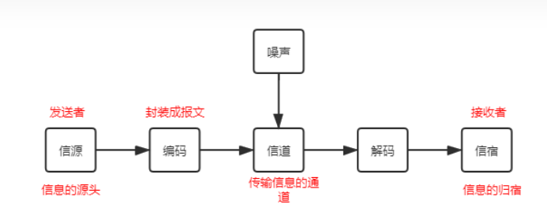

> **国家信息化体系的6个要素**

- 信息资源：**核心任务**

- 信息网络：信息资源开发和信息技术应用的**基础**，是信息传输、交换、共享的**手段**

- 信息技术应用：**龙头**

- 信息产业：信息化的基础

- 信息化人才：成功之本

- 信息化政策、法规、标准和规范：**保障**

  资网技术产人政

  

> 相关概念

- 电子政务：对现有政府形态的改造

- 电子商务：网上购物、企业之间网上交易、在线电子支付

- 企业信息化：建立在企业**战略**规划基础上的企业管理模式，**技术**和**业务**的融合（企业战略、业务运作、管理运作）企业信息化是指企业以业务流程的优化和重构为基础，利用**计算机技术**、**网络技术**和**数据库技术**

  - 业务流程重构方法
  - 核心业务应用方法
  - 信息系统建设方法
  - 主题数据库方法
  - 资源管理方法
  - 人力资本投资方法

- ERP(Enterprise Resource Planning)： 企业资源计划

- **CRM**(Customer Relationship Management)：以**客户**为中心，触发中心、挖掘中心

- SCM(Supply Chain Management)：供应链管理，信息流、物流、资金流、商流，增值链

- **EAI**(Enterprise Application Integration)：企业应用集成

  - 界面集成(表示集成)：用户界面、浏览器界面

  - 平台集成：底层结构软硬件集成

  - 数据集成：数据和数据库

  - 应用集成(控制集成)：应用函数

  - 过程集成：业务管理、进程模拟

    界平数应过

- BI(Business Intelligence)：商业智能

- OLAP(On-Line Analytical Processing)：联机分析处理

- DM(Data Mining)：数据挖掘，

  - 描述型数据挖掘：数据总结、聚类、关联分析。
  - 预测型数据挖掘：分类、回归、时间序列。
  - 数据规约：尽可能地精简数据

- DW(Data Warehouse)：数据仓库是一个面向主题的、集成的、非易失的、反映历史变化的数据集合，用于支持管理决策。

  - ETL：数据清洗
  - 元数据：关于数据的数据
  - 粒度：保存数据的细化程度，细化越高，粒度越小
  - 分割：物理存储单元
  - 数据集市：小型数据仓库
  - ODS：操作数据存储

> **新一代信息技术**

- 大数据（Big Data）：5V，大量、高速、多样、低价值密度、真实性
- 云计算（Cloud Computing）：
  - 基础设施即服务 IaaS
  - 平台即服务 Paas
  - 软件即服务 Saas
- 智慧城市
  - 具有依赖关系的5层：物联感知层、通信网络层、计算与存储层、数据及服务支撑层、智慧应用层
  - 3个支撑体系：安全保障体系、建设和运营管理体系、标准规范体系
- 物联网（Internet of Things）
  - 感知层：信息采集
  - 网络层：信息传输
  - 应用层
- 移动互联网
  - SOA：面向服务的体系结构
- 人工智能（Artificial Intelligence）
- 区块链（Blockchain）：分布式，去中心化数据库
- 元宇宙（Metaverse）

### 1.2 信息系统

> 信息系统服务

- 信息技术咨询服务
- 系统集成服务：硬件集成、软件集成、数据和信息集成、技术与管理集成、人与组织机构的集成
- 技术支持服务

> 信息系统工程监理

- 定义：受业主单位委托，依法、技术标准和合同，对信息系统工程项目实施监督管理

- “**四控、三管、一协调**”：投资控制、进度控制、质量控制、变更控制、安全管理、信息管理、合同管理、沟通协调

> 信息系统规划（Information System Planning）ISP

- 原则：支持企业战略，自顶向下规划、自底向上实现，能应变，便于实施
- 流程：分析现状、制定战略、拟定架构
- ISP的第三阶段以集成为核心，围绕**企业战略需求**进行，主要方法包括价值链分析法等。
- **方法**：
  - **PERT**图(Project Evaluation Review Technique) 和 甘特图(Gantt)
    - PERT：项目计划评审技术
  - 调查表，调查提纲
  - 会谈和正式会议
  - 过程/组织矩阵 （**P/O矩阵**）：每个过程与组织的联系
  - 资源/数据矩阵（**R/D矩阵**）：归纳出数据类
  - CU矩阵(Create User)：企业过程，数据类

### 1.3 软件知识

> 信息系统建设

- 生命周期：产生、开发、运行、消亡
  - 总体规划：系统规划，可行性分析，项目开发计划
  - 系统分析：逻辑设计，需求分析
  - 系统设计：概要设计，详细设计
  - 系统实施：编码，测试
  - 系统验收与维护
- 开发方法：
  - 结构化方法：模块化设计、自顶向下、逐步细化
    - 结构化方法的核心是数据字典
    - **E-R图**（实体联系图）- 数据模型
    - **数据流图**（DFD）- 功能模型
    - **状态转化图**（STD）- 行为模型
  - 快速原型法：根据用户需求，快速建立模型并展示
  - 面向对象法：封装、继承、多态

> 软件开发模型

- 瀑布模型：适用于**需求稳定**、很少变更，制定计划、需求分析、软件设计、程序编写、软件测试、运行维护
- 演化模型：适用于对需求**缺乏准确认识**
- 增量模型：交错的线性序列，**增量包**
- **螺旋模型**：适用于**大型复杂系统**
- 喷泉模型：用于描述面向对象的软件开发过程，自下而上无间隙
- V模型
- RUP：统一软件开发过程是一个面向对象且基于网络的程序开发方法论
- 敏捷开发模型：快速迭代

> 软件工程

- 软件需求

  - 业务需求：客户对系统**高层次**的目标要求
  - 用户需求：使用产品
  - 功能需求：必须实现的功能

- 软件设计

  - 内聚性从低到高：内聚是一个**模块内部**各个元素彼此结合的紧密程度

    偶然内聚、逻辑内聚、时间内聚、过程内聚、通信内聚、顺序内聚、功能内聚

  - 耦合性从低到高：**模块之间**结合紧密度的一种度量

- 软件测试：目的检验软件**是否满足**规定的需求或弄清预期结果与实际结果之间的差别

  - 白盒测试：结构测试，

    覆盖程度弱到强：语句覆盖、判定覆盖、条件覆盖、判定/条件覆盖、条件组合覆盖、路径覆盖

  - 黑盒测试：功能测试，不考虑内部结构

  - 灰盒测试：白黑之间，关注输入的正确性

  - α测试：开发环境；β测试：用户环境

  - 桌前检查：程序员自己检查；代码审查：评审小组进行静态分析；代码走查：让与会人员充当计算机

  - 性能测试：负载测试、压力测试

  - **确认测试**：目的是确保构造了正确的产品

- 软件维护：纠错性维护，尚未发现的错误；适应性维护，适应需求变化；完善性维护，扩充功能、改善性能；预防性维护，未来

> 软件过程改进

- **CMMI成熟度模型**

  | 成熟度等级 | 过程域                                                       |
  | ---------- | ------------------------------------------------------------ |
  | 完成级     | 无                                                           |
  | 管理级     | 需求管理、项目计划、项目监控、供应商合同管理、度量与分析、过程与产品质量保证、配置管理 |
  | 定义级     | 需求开发、技术解决方案、产品集成、验证、确认、**组织过程焦点**、组织过程定义、组织培训、集成项目管理、风险管理、决策分析与解决、集成团队、集成组织环境 |
  | 量化管理级 | 组织过程性能、量化项目管理                                   |
  | 优化级     | 组织改革与实施、原因分析与决策                               |

- **四类过程域**

  | 连续式分组 | 过程域                                                       |
  | ---------- | ------------------------------------------------------------ |
  | 过程管理   | 组织开头                                                     |
  | 项目管理   | 带项目，                                                     |
  | 工程       | 需求管理、需求开发、**技术解决方案**、产品集成、验证、确认   |
  | 支持       | 配置管理、度量与分析、过程与产品质量保证、决策分析、集成组织环境、原因分析 |

> UML 统一建模语言

- 类图：描述类及特征
- 对象图：类的基础上给值
- 包图：带标签的文件夹符号
- 用例图：参与者，一次连贯的操作
- 构件图：模块化元素，隐藏了内部的实现
- 复合结构图：显示结构化类的内部结构
- 顺序图：有顺序，发送与接收
- 通信图：重点在连接
- 部署图：有服务器、客户端
- 活动图：描述过程行为与并行行为
- 状态机图：描述对象状态的转移

> 软件架构

- 2层C/S架构 客户端/服务器
- 3层C/S架构
- B/S架构 浏览器/服务器

- 风格分类：数据流、调用/返回、独立构件、虚拟机、仓库
- SOA：面向服务的体系结构，粗粒度、松耦合
- XML：可扩展标记语言，解决了数据表示问题
- 中间件技术：远程过程调用、面向消息的中间件、对象请求代理、事务处理监控

### 1.4 网络与安全知识

> **OSI/RM七层结构**

物数网传会表应

| 层次 | 名称       | 主要功能                           | 主要设备及协议            |
| ---- | ---------- | ---------------------------------- | ------------------------- |
| 7    | 应用层     | 实现具体应用                       | POP3 TFP HTTP SMTP Telnet |
| 6    | 表示层     | 数据的格式与表达、加密、压缩       |                           |
| 5    | 会话层     | 建立、管理、终止会话，（建立通道） |                           |
| 4    | 传输层     | 端到端连接                         | TCP UDP                   |
| 3    | 网络层     | 分组传输、路由选择                 | 路由器、ARP、             |
| 2    | 数据链路层 | 传送数据帧                         | 网桥、交换机、网卡        |
| 1    | 物理层     | 二进制传输                         | 中继器、集线器            |

TCP/IP：整合567为应用层，12为网络接口层

- 层次化的网络设计：核心层、汇聚层、接入层；原则：可靠性、安全性、高效性、可扩展性

- IEEE 802.3 - 以太网；IEEE 802.11 - 无线局域网

- 网络接入方式：拨号连接、ADSL、DDN、局域网接入；wifi、bluetooth、IrDa（红外）、WAPI、4G

- 网络存储技术：

  - DAS 直接存储：直接与主机系统连接
  - NAS 网络附属存储：独立服务器
  - SAN 存储域网络：专用存储网络，
  - ISCSI 小型计算机系统接口

- IPv4：

  0.0.0.0 - 当前主机；255.255.255.255 - 广播地址

  | 名称      | 说明                                         | 子网掩码      |
  | --------- | -------------------------------------------- | ------------- |
  | A类ip地址 | 1字节网络地址+3字节主机地址，最高位必须是0   | 255.0.0.0     |
  | B类ip地址 | 2字节网络地址+2字节主机地址，最高位必须是10  | 255.255.0.0   |
  | C类ip地址 | 3字节网络地址+1字节主机地址，最高位必须是110 | 255.255.255.0 |
  |           |                                              |               |

- IPv6：地址长度128位

> 信息与网络安全

- 威胁：从外部给系统造成损害；脆弱性：从内部给系统造成的损害

- 七定：**定方案**、定岗、定位、定员、定目标、定制度、定工作流程

- 加密技术

  - 对称加密：加密解密同一个
    - **DES**：56位秘钥及附加8位奇偶校验
    - IDEA：128位秘钥
  - 不对称加密：公钥、私钥
    - **RSA**：大数的因式分解
    - DSA：基于整数有限域离散对数难题
  - 不可逆加密算法（报文摘要算法）
    - MD5
    - SHA1

- 数字签名：是不对称加密算法的应用

- PKI/CA 与 PMI 数字证书认证中心

  - 过程：数字证书由CA经过数字签名，发给网上交易主体

- 访问控制

  - **DAC** 自主访问控制：对每个用户给出访问资源的权限
  - ACL 访问控制列表：访问者列表
  - MAC 强制访问控制模型：事先分配不同的安全级别属性，然后与级别比较，国家安全机构、军事
  - RBAC 基于角色的访问控制模型：把访问分配给不同角色，通过饰演不同角色来获得访问许可

- 信息系统安全等级(五级)

  | 等级   | 说明                                                         |
  | ------ | ------------------------------------------------------------ |
  | 第一级 | 对公民、法人、其他组织造成损害，不损害国家                   |
  | 第二级 | 对公民、法人、其他组织造成严重损害，对社会秩序造成损害，不损害国家 |
  | 第三级 | 对社会造成严重损害，对国家造成损害                           |
  | 第四级 | 对社会造成特别严重损害，对国家造成严重损害                   |
  | 第五级 | 对国家造成特别严重损害                                       |

- 网络安全设备与技术
  - 防火墙：**事先定义好策略**
  - 入侵检测：IDS是被动防御
  - 入侵防护：IPS是主动防御
  - VPN：专用网络技术
  - WEB应用防护
  - 网页防止篡改
  - 单点登录

## 2.项目管理十大知识领域

> 项目管理一般知识

- 项目：是为达到**特定目的**，使用一定资源，在**确定的期间**内为特定发起人提供**独特**产品、服务或成果而进行的**一次性**努力。

  - 项目目标遵循SMART原则
    - S（Specific）：目标明确
    - M（Measurable）：目标可度量
    - A（Attainable）：目标可实现
    - R（Relevant）：目标与工作相关
    - T（Time-based）：有时间限制
  - 项目特点：临时性、独特性、渐进明细性

- 项目经理：要当担领导者和管理者双重角色

- 项目干系人：**项目经理**、**用户**、**项目执行组织**、**项目发起者**、职能经理、项目管理办公室(**PMO**)

  - PMO分类：支撑型，充当顾问提供经验；控制型，提供项目支持，要求服从管理策略；指令型，直接管理；

- PMBOK（Project Management Body Of Knowledge，项目管理知识体系）

  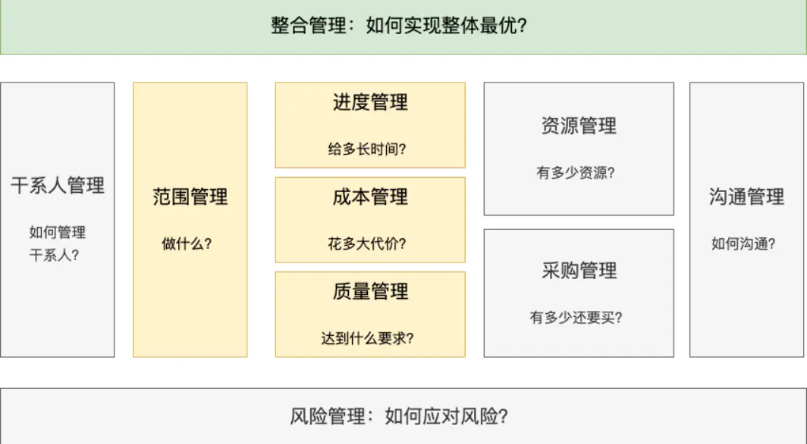

- **项目组织的方式**

  | 组织方式   | 说明                                         | 优点                             | 缺点                                         | 图例                                                         |
  | ---------- | -------------------------------------------- | -------------------------------- | -------------------------------------------- | ------------------------------------------------------------ |
  | 职能型     | 按职能划分部门，适用于规模小，偏重技术的项目 | 技术支持、权责清晰、清晰晋升路线 | 职能利益优先于项目，协调难度大，项目经理无权 | 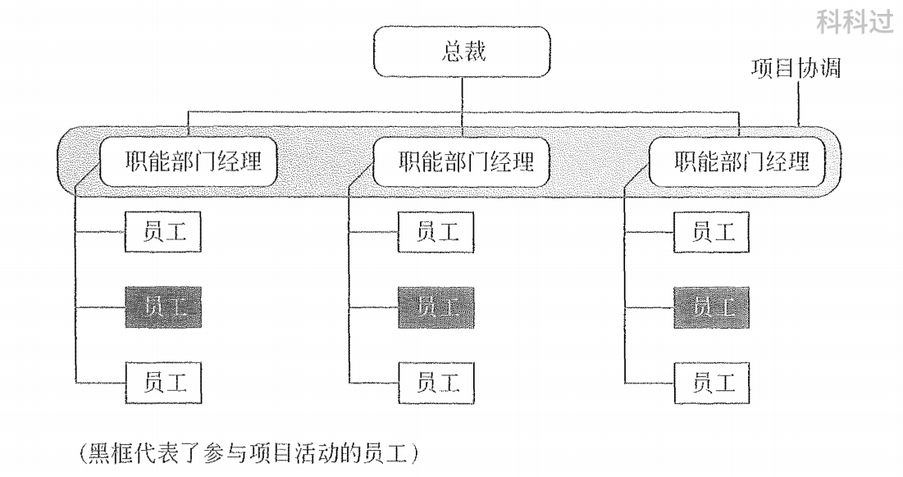 |
  | 项目型     | 适用于规模大，技术复杂的项目                 | 结构单一，统一指挥               | 管理成本高，不利于沟通，员工事业缺乏连续性   | 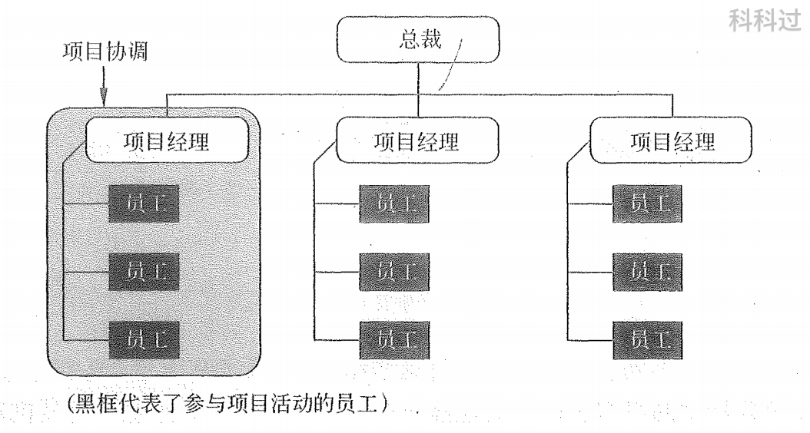 |
  | 弱矩阵型   | 项目经理权力弱，是协调人，兼职               |                                  |                                              | 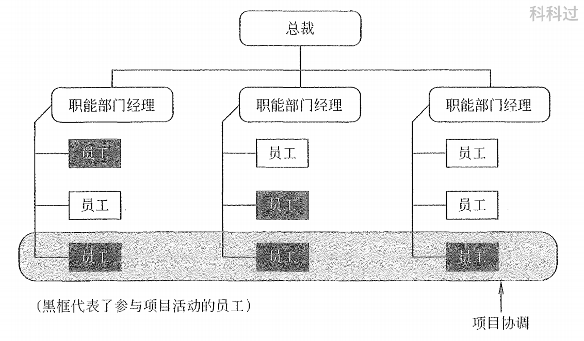 |
  | 强矩阵型   | 项目经理权力大于职能经理，项目经理全职       |                                  |                                              | 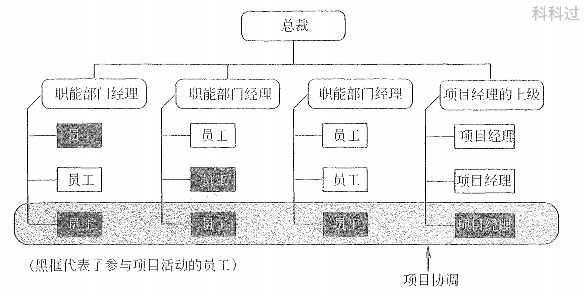 |
  | 平衡矩阵型 | 项目经理和职能经理分享权力，兼职             | 响应快，促进学习                 | 出现责任不明                                 | 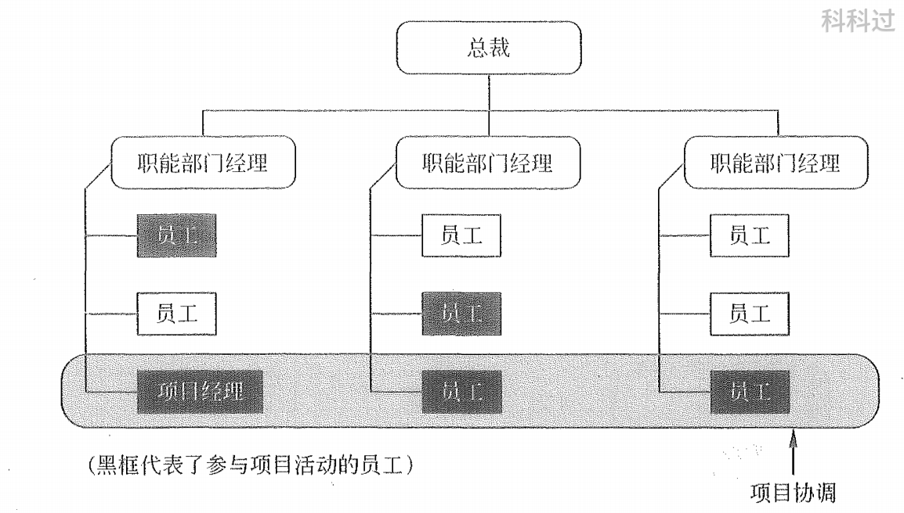 |

- 项目生命周期

  - 定义、开发、实施、收尾
  - 项目生命周期是产品生命周期的一部分

- **项目管理过程**

  - PDCA（Plan、Do、Check、Act）
  - 启动过程组：主要任务确定并核准项目，主要成果是形成项目章程并选择项目经理
  - 规划过程组：确定和细化目标
  - 执行过程组：实施项目计划
  - 监控过程组：实时监控项目的进展，变更控制
  - 收尾过程组：验收

  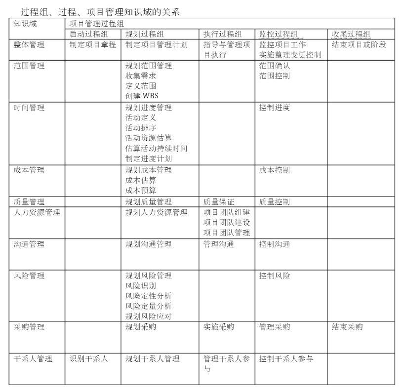

### 2.0 项目立项管理

- 主要内容：需求分析、编制项目建议书、可行性研究、项目审批、招投标、合同谈判与签订

- 需求分析：弄清项目发起人及其他干系人的要求，确定要做什么

- 项目建议书：项目简介与项目建设单位情况、项目的必要性、业务分析、总体建设方案、本期醒目建设方案、环保、消防、职业安全、项目实施进度、投资估算与资金筹措、效益风险分析。

  - 项目建议书是可行性研究的依据

- 可行性研究：该项目是否值得投资和如何进行建设

  - 投资必要性

  - 技术可行性

  - 财务可行性

  - 组织可行性

  - **经济可行性**

    - 支出分析：一次性支出、非一次性支出
    - 收益分析：直接收益、间接收益
    - 收益投资比、投资回收期分析
    - 敏感性分析：

  - 社会可行性

  - 风险因素对策

    "**投技财组经社风**"

  - 超出已批复总投资额度的**10%**，应重新报批可行性研究

- 成本效益分析

  - 净现值(Net Present Value，**NPV**)：现金净流量以资金成本为贴现率折现之后，与原始投资额现值的差额。NPV大于0则方案可行

- **项目论证**：

  - 机会研究
  - 初步可行性研究
  - 详细可行性研究：经济评价法、市场预测法、投资估算法、增量净效益法
  - 评价和决策

### 2.1 项目整体管理

- **主要过程**：制定项目章程、制定项目管理计划、指导与管理项目工作、监控项目工作、整体变更控制、结束项目或阶段

> 制定项目章程

- 定义：正式授权一个项目和项目资金的文件，由**项目发起人**或项目组织之外的主办人颁发。谁签发，谁修改
- 作用：宣布项目存在，固定项目总体范围、时间、成本、质量，**正式任命项目经理**，叙述启动项目的理由
- 项目经理的产生：企业高管委派，企业和用户协商选择，竞争上岗；项目经理是协调工作，整合资源
  - 能力：解读项目信息的能力、发现和整合项目资源的能力、将项目构想变成项目成果的能力
- **内容**：立项的**理由**；**项目干系人**的需求和期望；必须满足的业务**需求**和产品需求；委派的**项目经理**及权限；**里程碑**进度计划；项目**干系人影响**；概要**预算及投资回报率**；项目主要**风险**；可测量的项目**目标**和成功标准

> 制定项目管理计划

- 项目整体管理的过程是围绕项目管理计划进行的。

- 项目计划内容：项目整体介绍、项目组织描述、项目所需的管理程序和技术程序、所需完成的任务、时间进度、预算
- 项目管理计划是**渐进明细**的

> 指导与管理项目工作

> 监控项目工作

- 监控工作贯穿整个项目管理过程，以项目管理计划为基准

> 实施整体变更控制

- 流程：项目变更越早，成本越低
  - 及时**识别**变更
  - **管理**已识别的变更
  - **维持**所有基线的**完整性**
  - 根据已批准的变更，**调整项目**范围、成本、时间、质量；
  - 使用质量报告，**控制项目质量**
  - **维护文档**信息库，直至项目结束
- 变更控制委员会 CCB
  - 项目经理提出变更请求
  - CCB审批变更请求，但不负责审查和评价
- 变更控制流程：变更申请、变更评估、变更决策、实施变更、变更验证、沟通存档

> 结束项目或阶段

- 合同收尾：项目验收
- 管理收尾(行政收尾)：文档归档，释放资源，转入维护，经验总结

### 2.2 项目范围管理

- 主要过程：规划范围管理(范围管理计划编制)、收集需求、范围定义、创建WBS、范围确认、范围控制

> 规划范围管理

- 规划范围管理就是定义、确认和控制项目范围的过程。该过程在整个项目中，是管理范围的指南
	
	管理计划中的主要内容是有关“方法”的说明，但并不会具体说明项目的范围

> 收集需求

- 方法：焦点小组、群体决策技术、观察、问卷调查、原型法、标杆对照

> 范围定义

- 范围定义就是制定项目和产品详细描述的过程，**详细的项目范围说明书**是范围定义工作最主要的成果

- 项目范围说明书内容：项目目标、项目可交付成果的规定、**项目边界**、**项目配置关系及其管理要求**、项目批准的规定、制约因素、**验收标准**

> 创建WBS（Work Breakdown Structure）

- 工作分解结构：将大问题分解为更小、更容易管理与解决的问题的过程

- WBS的编制需要主要项目干系人、项目团队成员的参与
- WBS的构成
  - 结构化编码：4-6层
  - **工作包**：是WBS的**最底层元素**，每个工作包的工作应介于一个人工作**8h-80h**，工作包还能继续分为**活动**
  - WBS元素：结点
  - **WBS字典**：用于描述和定义WBS元素中的工作文档
- WBS的创建方法
  - 类比方法
  - 自上而下与自下而上的方法
  - 使用指导方针
  - 滚动波策划
- 分解WBS结构采用的表现形式：按子项目、阶段、功能分
- 创建WBS需要遵循的原则
  - 各层次保持项目的完整性，避免遗漏
  - 每个工作单元只从属某一上层单元
  - 同层的工作单元性质可不同，分解方法需相同
  - 工作单元应能分开不同责任者和不同工作内容，每个元素有且仅有**一个人负责**，但可以多人参与
  - 便于管理者对项目的计划、控制
  - 最底层工作包应是可比、可管理、可定量检查
  - 包括项目管理工作（**包含外包部分**）

> 范围确认

- 项目范围确认是客户等项目相对外部的干系人**正式验收**并接受已完成的项目可交付物的过程

- 范围确认应该**贯穿项目的始终**

> 范围控制

- 内容：识别范围变更的因素，确保遵循整体变更流程，管理实际变更
- 范围变更应该通过整体变更过程处理，变更均需通过CCB
- 范围控制的主要方法是**偏差分析**

### 2.3 成本管理

- 主要过程：规划成本管理、成本估算、成本预算、成本控制
- 目标：确保在批准的预算范围内完成项目所需的各个过程

> 成本管理的重要术语

- 全生命周期成本：开发成本和维护成本
- 可变成本：原料、劳动、燃料
- 固定成本：工资、固定税收
- 直接成本：直接计入成本的费用
- 间接成本：工资、福利、水电等
- 沉没成本：已付出，不可回收
- **应急储备**：应对已经接受的已识别风险，属于成本基准、总预算，项目经理**直接支配**
- **管理储备**：以备未来不可预见的事件发生，**不属于成本基准**，属于总预算，**需申请**才可使用
- 成本基准：**经批准**的按时间安排的成本支出计划
- 机会成本：做出选择之后，其中一个最大的损失

> 规划成本管理

> 成本估算

- 是对完成项目活动所需资金进行近似估算的过程

  - 识别并分析成本的构成科目
  - 根据已识别的项目成本构成科目估算每一科目的成本大小
  - 讲评成本估算结果，找出各种可以互相替代的成本，协调各种成本之间的比例关系

- **成本估算方法**：类比估算法；专家判断；自下而上估算法；参数估算法；三点估算；储备分析；

  - **三点估算**：

    - β分布公式：

    $$
    预期成本：C_{E} = (C_{O}+4C_{M}+C_{P})/6
    $$

    - 三角分布式：
	  
    $$
    预期成本：C_{E} = (C_{O}+C_{M}+C_{P})/3
    $$
  

> 成本预算

- 是汇总所有单个活动或工作包的估算成本，形成一个经批准的成本基准的过程
- 步骤：
  - 分摊项目总成本到WBS的各个工作包中，为每一个工作包建立总预算成本
  - 将每个工作包分配得到的二次分配到工作包的各项目上
  - 确定各项目成本预算支出的时间计划
- 项目成本预算的原则：以项目需求为基础，与项目目标相联系，考虑项目目标和进度，切实可行，留有一定弹性

> 成本控制

- 是监督项目状态，以更新项目成本，管理成本基准变更的过程
- 内容：
  - 对造成成本基准变更的因素施加影响
  - 确保变更请求获得同意
  - 当变更发生时，管理这些实际的变更
  - 监督成本执行，找出与成本基准的偏差
  - 准确记录所有与成本基准的偏差
  - 防止错误的、不恰当的或未获批准的变更纳入成本或资源使用报告中
  - 将审定的变更、通知项目干系人
  - 采取措施，将预期的成本超支控制在可以接受的范围内

> **挣值分析**

- 实际费用（Actual Cost，**AC**）：实际花费
- 挣值（Earned Value，**EV**）：这点活，值多少钱
- 计划费用（Planned Value，**PV**）：计划花费

- **CPI** 成本绩效指数：应该挣多少/投了多少，*CPI = EV/AC*；CPI>1结余；CPI<1超支；
- CV 成本偏差：CV = EV-AC >0 结余
- **SPI** 进度绩效指数：干的活/计划干的活，*SPI = EV/PV*；SPI>1勤奋；SPI<1落后；
- SV 进度偏差：SV = EV - PV >0 进度超前
- BAC 项目完工总预算：
- **ETC** 完工尚需估算：
  - **非典型偏差**ETC：剩下按计划执行	*ETC = BAC - EV* 
  - **典型偏差**ETC：继续偏差趋势发展    *ETC = (BAC - EV)/CPI*
- EAC：完工估算 EAC = ETC + AC 

### 2.4 项目进度管理

- 主要过程：规划进度管理、活动定义、活动排序、活动资源估算、估算活动持续时间、制订进度计划、进度控制

> 规划进度管理

 项目进度网络图、横道图、里程碑图

> 活动定义

- 活动是项目工作包的进一步分解和界定

- 工具：分解、滚动式规划、专家判断
- 检查点：规定的时间间隔内对项目进行检查
- 里程碑：完成阶段性工作的标志
- 基线：重要的里程碑

> 活动排序与网络图

- E：Early；F：Finish；L：Late；S：Start
  - ES：最早开始时间
  - EF：最早结束时间
  - LS：最晚开始时间
  - LF：最晚结束时间
- T：Total；F：Free；F：Float
  - TF：总浮动时间
  - FF：自由浮动时间
- 前导图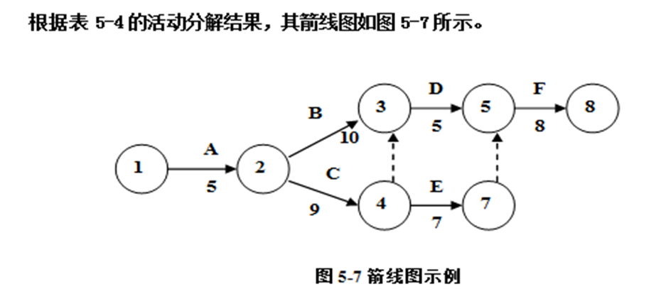
- 箭线图
- 虚活动：既不消耗时间，也不消耗资源

> 活动资源估算

> 估算活动持续时间

方法：专家判断、类比估算、参数估算、三点估算

- **三点估算**
  - 期望时间（PERT值）= （悲观 + 4x最有可能 + 乐观）/6
  - 标准差（σ）= （悲观 -乐观）/6
  - 2σ：68.26%；4σ：95.46%；6σ：99.74%；
- **关键路径法**:不错详细论述

> 进度计划

- 关键链法：
  - 增加项目缓冲（放置在关键链末端的缓冲）
  - 接驳缓冲（非关键链和与关键链结合处）
- 资源优化技术
  - 资源平衡：导致关键路径改变，延长时间
  - 资源平滑：调整活动，不改变关键路径
- 关键路径法
- 建模技术：假设情景分析；模拟
- 提前量、滞后量
- 进度压缩技术
  - 赶工：通过增加资源，来压缩进度工期；**加班**、增加额外资源、支付加急费用。可能导致风险和成本增加
  - 快速跟进：将部分顺序进行的活动**调整为并行**的方式。可能导致返工和风险增加

> 进度控制

- 项目进度控制的作用：
  - 确定项目进度的当前状态
  - 对引起进度变更的因素施加影响
  - 确定项目进度已经变更
  - 当变更发生时管理实际的变更
- **缩短工期的方法**：
  - 赶工，缩短关键路径上的工作历时
  - 采用并行施工的方法（快速跟进）
  - 加强质量管理，减少返工，缩短工期
  - 改进方法和技术
  - 缩减活动范围
  - 使用高质量的资源或经验丰富的人

### 2.5 项目质量管理

- GB/T 19000-2000：**质量方针**、**质量目标**、**质量策略**、**质量标准**

- ISO 9000 质量管理8条原则：以**顾客为中心**、领导作用、**全员参与**、过程方法、系统管理、持续改进、以事实为决策依据、互利的供方关系
- 质量管理流程：确立质量标准体系、质量监控、实际与标准对照、纠偏纠错
- 6σ：3.4

#### 质量管理过程

> 规划质量管理

- 目的：准备对策，确保符合质量要求

- 考虑三个方面问题：
  - 明确质量标准
  - 确定关键因素
  - 建立控制流程

- 主要内容：编制依据、质量宗旨与质量目标、质量责任与人员分工、项目各个过程及其依据、质量控制的方法与重点、验收标准

- 工具和技术

  - 效益成本分析：收益要超过成本

  - 质量成本

    - **一致性成本**：预防成本、评价成本、质量保证成本，用于预防失败的成本
    - **非一致性成本**：内部、外部失败成本，是为纠错而付出的成本

  - 标杆对照：基准比较

  - 实验设计：确定影响特定变量的因素

  - 质量成本分析：预防成本、评估成本、缺陷成本（内部/外部）；

  - 统计抽样：总体中选出部分

  - 头脑风暴：

  - 力场分析：用图形来显示变更的推力和阻力

  - **名义小组**技术：先由小群体进行头脑风暴并提出创意，再由大群体对所有创意进行评审和排序

  - 七种基本质量工具

    | 图表类（旧）                 | 说明                                 | 样式                                                         |
    | ---------------------------- | ------------------------------------ | ------------------------------------------------------------ |
    | **因果图：石川图、鱼刺图**   | 生产过程中追溯责任                   | 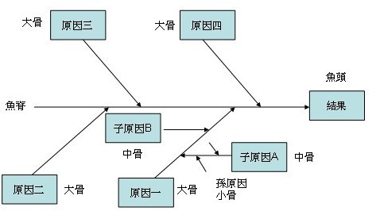 |
    | 控制图                       | 有控制界限，是否稳定                 | 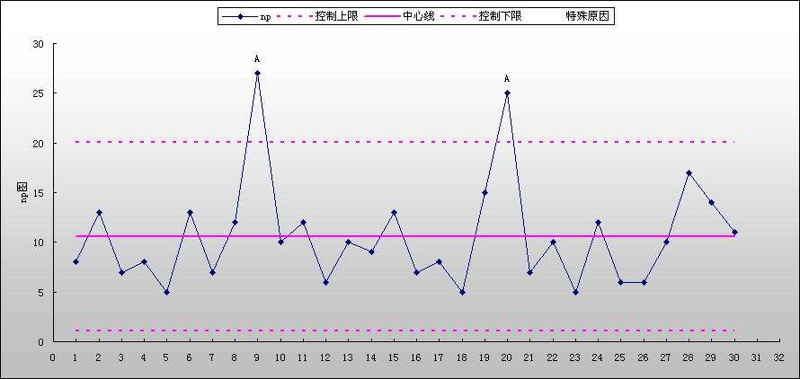 |
    | 散点图                       | 两个变量之间的关系                   | 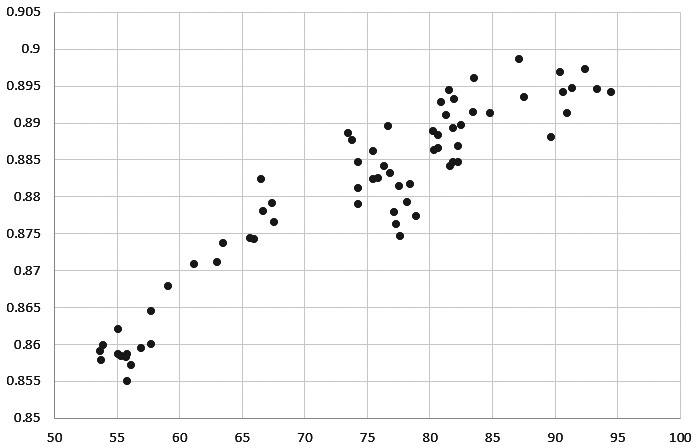 |
    | 流程图                       | 显示相关要素之间的示意图             | 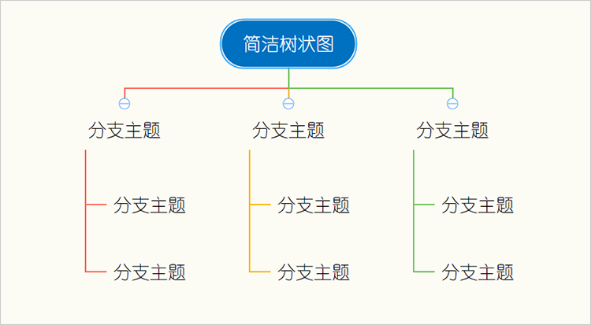 |
    | 直方图                       | 描述集中趋势、分散程度、统计分布形状 | 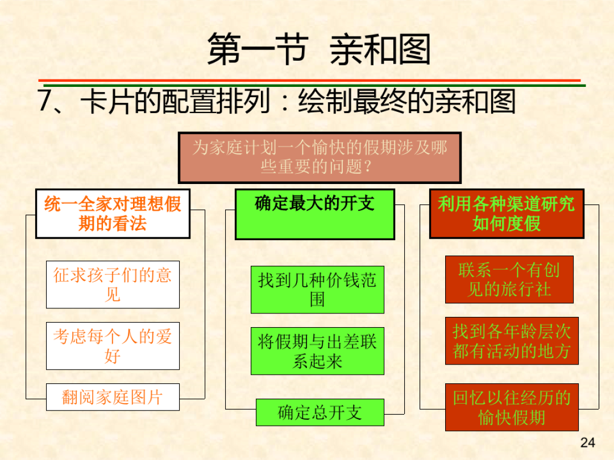 |
    | **帕累托图**，主次因素分析图 | 0%~80% A，80%~90% B，90%~100% C      | 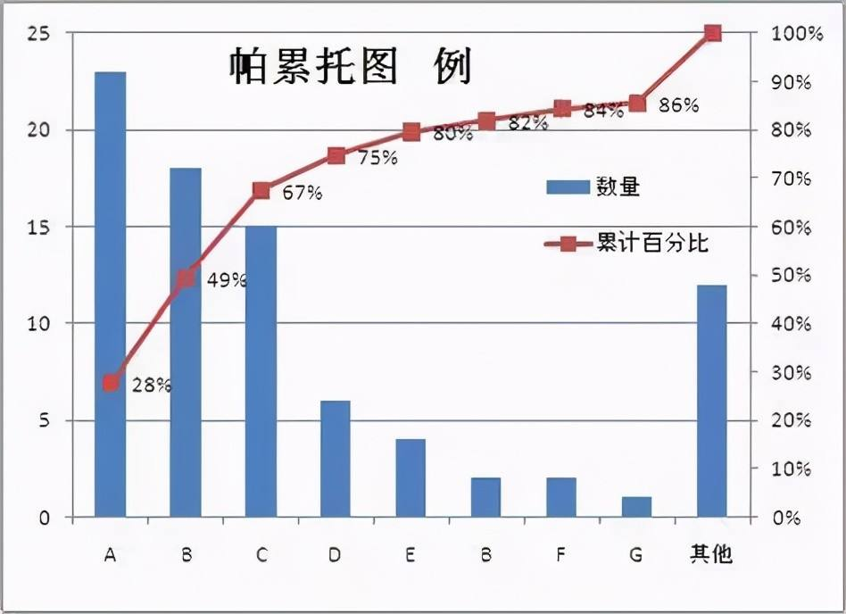 |
    | 检查表                       |                                      |                                                              |

    - 帕累托分析："20%的人掌握80%的资源",在任何特定群体中，重要的因素只占少数，只要控制关键的少数因素即能控制全局
    
    | 图表类（新）           | 说明                                                   | 样式                                                         |
    | ---------------------- | ------------------------------------------------------ | ------------------------------------------------------------ |
    | 相互关系图             | 用连线来表示互相关系                                   | 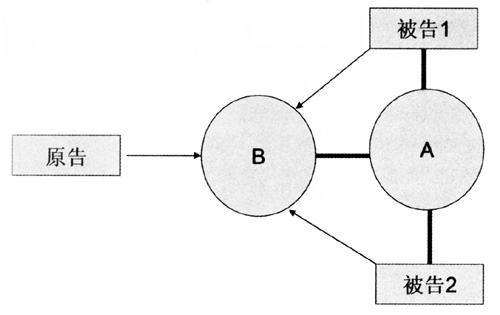 |
    | 亲和图                 | 先定主题，然后整理归纳                                 |  |
    | 树状图                 | 把目的或手段作为根节点                                 |  |
    | 矩阵图                 | 在问题中寻找成对的因素群，关系填符号                   | 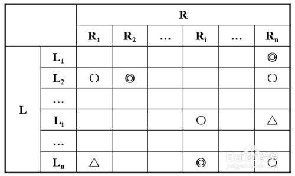 |
    | 优先矩阵图             | 关系填数据                                             | 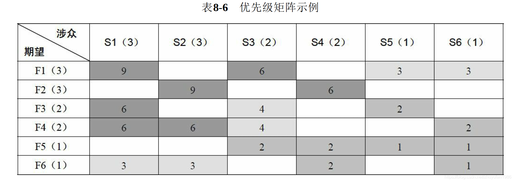 |
    | **过程决策程序图**     | 用于理解一个目标与达成目标的步骤之间的关系             | 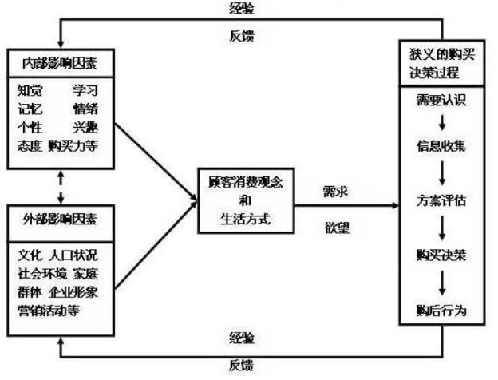 |
    | **活动网络图、箭线图** | 每项活动都用一根箭线和两个结点表示，每个结点都编以号码 | 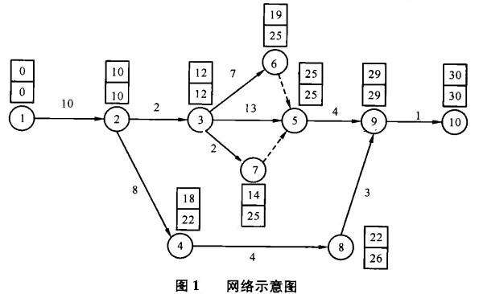 |

> 质量保证：贯穿整个项目全生命周期

- 质量保证过程的主要作用是**促进质量过程改进**，

- 质量保证致力于**增强**满足质量要求的**能力**，质量控制致力于**满足**具体的质量**要求**
- 质量保证的内容
  - 制定质量标准
  - 制定质量控制流程
  - 提出质量保证所采用的方法和技术
  - 建立质量保证体系：责任到每个人；制作手册、文档；人员培训

> 质量控制：PDCA **计划、执行、检查、改进**的循环过程

- 质量控制是监督并记录质量活动执行结果，以便评估绩效，并采取必要变更的过程
- 质量控制过程的主要作用是确认项目的可交付成果满足干系人的既定需求

### 2.6 项目人力资源管理

- 主要过程：人力资源计划编制（规划人力资源管理）、项目团队组建、项目团队建设、项目团队管理

> 人力资源计划编制

- 内容：组建项目团队、项目角色与职责定义、时间安排、成员遣散安排、培训需求
- 组织机构图：工作分解结构（WBS）、组织分解结构（OBS）、资源分解结构（RBS）
- OBS：是一种用于表示组织单元负责哪些工作内容的特定的组织图形，OBS不是按照项目可交付成果的分解组织，而是**按照组织设置的部门、单位和团队组织**
- RES：用于分解项目中各种类型的资源，包含人力资源、设备资源、材料资源
- RAM：责任分配矩阵为项目工作和负责完成工作的人建立了一个映射关系。将WBS中的每一项工作指派到OBS中的执行人
  - RACI：常见责任分配矩阵，谁负责、谁批准、咨询谁、通知谁

> 项目团队组建

- 项目经理的选择：高管委派、企业用户协商、竞争上岗
  - 三种能力：**解读项目信息**的能力；**发现和整合项目资源**的能力；**将项目构想变成项目成果**的能力
- 团队成员选择：招聘
- 激励理论
  - **马斯洛需求层次理论**：生理需求、安全需求、社会需求、尊重需求、自我实现
  - 赫茨伯格双因素理论：
    - 保健因素：造成员工不满的因素
    - 激励因素：使员工感到满意的因素
  - 期望理论：激励力 = 期望值 x 目标效价
  - ERG理论：生存需要、互相关系、成长发展
- X理论：认为人是懒惰的
- Y理论：认为人是积极的

> 项目团队建设

- 阶段：
  - 形成阶段：成员互相了解
  - 震荡阶段：团队开始工作，遇到困难和挑战
  - 规范阶段：团队协同工作，成员开始信任对方
  - 成熟阶段：工作非常有序，沟通高效
  - 结束阶段：团队解散
- 目标：提高个人和团队技能、提高团队凝聚力、创建团队文化
- 成功团队的特点：目标明确、结构清晰、明确的考核和评价标准、流程简化、组织纪律、团结

> 项目团队管理

- 工具与技术包：观察和交谈、项目绩效评估、问题清单、冲突管理
- 领导力、影响力、有效决策等软技能
- **冲突管理**：
  - 问题解决：皆大欢喜
  - 强制：牺牲一方，强制采用一方观点
  - 合作：多人接受
  - 妥协：各方协商均让步，又均有所获
  - 求同存异：关注一致的观点，忽略不同的观点
  - 撤退（回避）：先搁置冲突，避免争端

### 2.7 项目合同与采购管理

> 项目合同和合同管理

- 合同：必须包括以下要素：两个以上当事人、意思表示、意思表示达成一致
  - 具有法律效益必备3个条件：当事人具有相应的民事行为能力、当事人意思表示真实、不违反法律或社会公共利益
- 合同分类
  - 以信息系统工程项目的范围为标准划分
    - 项目总承包合同：适用于经验丰富、技术实力雄厚且组织管理协调能力强的承建方
    - 项目单项承包合同：有利于吸引更多的承建方参与投标竞争
    - 项目分包合同：发包给子承建方
  - 以付款方式划分
    - 项目总价合同：适用于工期短、不太复杂的小风险项目
    - 项目单价合同（工料合同）：风险分摊
    - 项目成本加酬金合同：风险最大
- 合同的主要内容：项目名称，标的内容和范围，质量要求，技术标准，项目计划，风险责任承担，技术成果归属，验收的标准和方法，支付方式等
- 软件所有权将转给业主方，软件的著作权仍然归属承建方
- 索赔在28天内
- 合同管理流程
  - 合同签订管理
  - 合同履行管理
  - 合同变更：提出变更、审查变更请求、批准变更、实施变更
- 合同的订立：
  - 要约：是希望与他人订立合同的意思表示
  - 要约邀请：希望他人向自己发出要约的表示
  - 承诺：是受邀约人同意要约的意思表示
  - 承诺生效：合同成立

> 规划采购

- 采购合同：总价合同、成本补偿合同、工料合同
- 采购文件
  - 信息索取书 RFI：获得所需产品/服务/供应商的信息
  - 请求方案建议书 RFP：要求供应商对问题提出解决方案
  - 请求报价邀请书 RFQ：提供报价，做参考
  - 投标邀标书 IFB：为所有供应商报价提供他们最佳方案的平等的机会

> 实施采购

> 控制采购

发现不合格产品应采取退货、换货、降级使用

> 结束采购

### 2.8 沟通管理

- 主要过程：规划沟通管理、管理沟通、控制沟通

- 认知障碍：个人学历经历，对不同事物有不同认知
- 语义障碍：个人修养，表达能力不同
- 沟通原则：尽早沟通、主动沟通、内外有别、采用对方能接受的沟通风格、沟通的升级原则
- 沟通途径计算：nx(n-1)/2
- 沟通分类：
  - 正式沟通、非正式沟通
  - 纵向沟通、横向沟通
  - 口头沟通、书面沟通、非语言沟通
  - 交互式沟通：信息交换，会议、电话
  - 推式沟通：把信息发送接收方，邮件、备忘录、报告、新闻
  - 拉式沟通：接受者自行访问，数据库、知识库
- 绩效报告：进展、资金、效益、制度、团队、问题
- **控制沟通在整个项目周期**，该过程的作用是随**时确保所有沟通参与者之间的信息流动最大化**
- 沟通程度：（控制强度 弱 - 强；参与强度 强 - 弱）
  - 参与/讨论；征询；说明/推销；叙述

### 2.9 干系人管理

- 规划干系人管理是一个反复的过程，应由项目经理定期开展
- 干系人管理活动顺序：查看项目章程和采购文件、识别干系人及其相关信息、制定干系人管理计划、管理干系人期望确保目标实现
- 干系人模型
  - **权力/利益方格**：高高 - 重点管理（建设方主管领导、客户、项目经理的主管领导）；高低 - 令其满意；低高 - 随时告知；低低 - 监督
  - 权力/影响方格
  - 影响/作用方格
  - 凸显模型：根据干系人的权力、紧迫度和合法性对干系人进行分类

### 2.10 项目风险管理

- 风险特征：客观性、普遍性、偶然性、必然性、可变性、多样性、多层次性；**随机性、相对性、可变性**
- 风险分类：
  - 来源：自然风险、人为风险
  - 可管理性：可管理风险、不可管理风险
  - 可预测性：已知风险、可预测风险、不可预测风险
- **主要过程**：规划风险管理、风险识别、风险定性分析、风险定量分析、风险应对计划编制、风险监控

> 规划风险管理

- 风险管理计划内容：简介、风险概要、风险管理的任务、组织和职责、预算、工具和技术、要管理的风险项

> 风险识别

- 内容：识别并确定项目有哪些潜在的风险；识别引起这些风险的主要因素；识别风险可能引起的后果
- 特点：全员参与、系统性、动态性、信息依赖性、反复性
- 工具：文档审查、信息收集技术、核对单分析、假设分析、图解技术、SWOT分析
  - 德尔菲：匿名反馈的函询法，专家就某一专题达成一致意见，有助于减少数据偏见，避免由于个人因素对项目风险识别的结果产生不良影响
  - 头脑风暴：充分发挥集体智慧，提高风险识别的正确性
  - SWOT：竞争优势/劣势/机会/威胁

> 风险分析

- 定性风险分析
  - 风险概率与影响评估
  - 概率和影响矩阵
  - 专家判断
  - 风险数据质量分析
  - 风险分类
  - 风险紧迫性评估
- 定量风险分析
  - **EMV期望货币价值**：概率相乘
  - 计算分析因子
  - PERT 计划评审技术
  - **蒙特卡洛分析：项目模拟和建模**

> 规划风险应对

| 消极风险应对策略 | 定义                             | 常见方式                               |
| ---------------- | -------------------------------- | -------------------------------------- |
| 规避             | 改变计划、排除风险；改变风险目标 | 延长进度、减少范围、改变策略、取消项目 |
| 预防             |                                  |                                        |
| 转移             | 转移责任                         | 保险、保证书、外包、                   |
| 减轻             | 降低风险概率到可接受范围         | 采用简单工艺、更多测试、增加冗余       |
| 接受             | 主动接受；被动接受               | 建立应急储备；不采取行动               |

积极风险应对：开拓、分享、提高、接受

> 控制风险

- 技术：风险再评估、风险审计、偏差分析、技术绩效测量、储备分析、会议

## 3.项目管理其他内容

### 3.1 文档、配置与变更管理

变更管理的目的是为了让项目基准与项目实际执行相一致，变更的实质是随着项目的深入，认知更加清晰，因此调整项目需求，提升项目价值

> 配置管理

- 配置项：配置项的操作权限应该由CMO严格管理，基线配置项向开发人员开放读取权限。非基线配置项向PM、CCB及相关人员开放
- 配置项六种类型：环境类、定义类、设计类、编码类、测试类、维护类
- 配置项状态：草稿、正式、修改
- **基线**：是软件生存期各开发阶段末尾的特定点，**里程碑**
- 配置管理三种基线：功能基线、分配基线、产品基线
- 配置状态报告
- 配置审核，配置审计
- **配置变更委员会CCB**，做出评价审批
- 配置管理系统：svn，git
- 配置库
  - 开发库（动态库）
  - 受控库（主库）
  - 产品库（静态库）

### 3.2 知识产权、法律法规、标准和规范

- 著作权人：创作者、开发者

- 受让者，后继著作权人：没有参与创作，通过著作权转移成为

- 著作权人享有的权利：发表权、署名权、修改权、保护作品完整权等

- 发表权、使用权和获得报酬权的保护期为**作者终身+50年**；企业是拥有50年

- 发明专利权的期限为**20年**，使用新型专利权、外观设计权的期限为**10年**

- 评标：要求5人上专家组成，技术、经济等专家比例不能少于**2/3**

- 招标人和中标人，需在**30日**内完成订立书面合同

- 招标人应自确定中标人**15日**内向有关部门提交书面报告

- **政府采购形式**

  | 采购形式   | 应用环境                              |
  | ---------- | ------------------------------------- |
  | 公开招标   | 主要方式                              |
  | 邀请招标   | 特殊供应商，**公开招标费用比例过大**  |
  | 竞争性谈判 | 技术复杂、时间紧急、无法计算总价      |
  | 单一来源   | **添加资金总额不超过原采购金额的10%** |
  | 询价       | 货源充足，变化幅度小                  |

### 3.3 项目管理高级知识

> 项目集管理

- 项目集：是一组相互关联且被协调管理的项目、子项目集和项目集互动，以便获得分别管理所无法获得的利益
- 项目组合管理：为了实现战略目标而组合在一起的管理的项目、项目集、子项目组合及其运营工作。项目组合中的项目或项目集不一定彼此依赖
- 项目集指导委员会的职责：
  - 保证项目集与组织愿景和目标的一致性
  - 项目集批准和启动
  - 项目集指导委员会还负责批准项目集章程和批准项目集商业论证
- SWOT分析：
  - SO策略：发挥优势、抓住机会
  - ST策略：利用优势、减少威胁
  - WO策略：克服弱点、利用机会
  - WT策略：弥补缺点、规避威胁
- 战略组织类型：
  - 开拓型组织：看中创新、适应性强、效率低
  - 防御型组织：建立稳定经营环境，效率高、市场适应性不强
  - 分析型组织：以小风险获取最大机会
  - 被动反应型组织：消极无效组织
- 组织战略实施类型
  - 指挥型：高层制定最佳战略，然后实施
  - 变革型：高层对组织进行变革
  - **合作型**：高层管理人员分担战略责任，发挥集体意志，调动全体管理人员
  - **文化型**：运用文化手段，向全体传播思想，动员
  - 增长型：自下而上产生

> 知识管理

- 显性知识
- 隐性知识
- 定性方法：同行评价、回溯分析法、德尔菲法
- 定量方法：投资回收期法、内部收益率法、现值法